Readme

## Expo Location Finding App

On refreshing it changes the location of the user and can share the location through different locations and login and signup with firebase.This is built on react native using expo cli.

## Screenshots

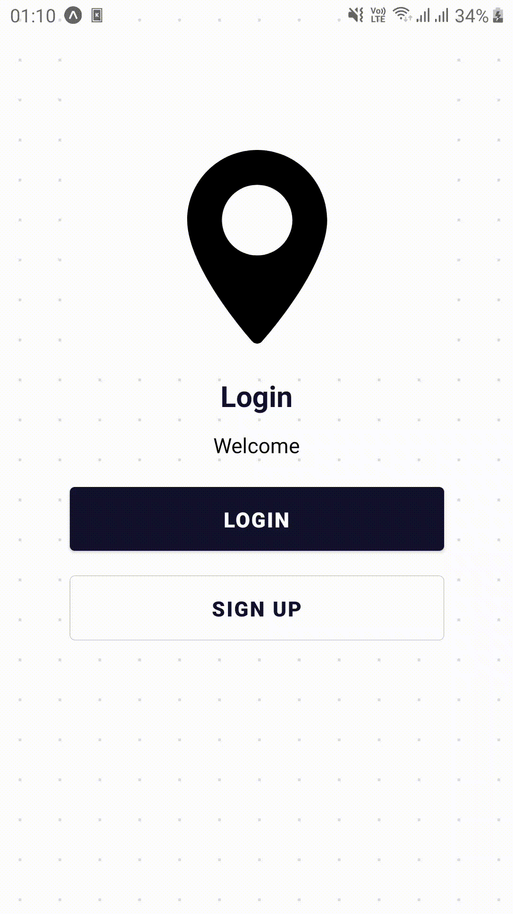

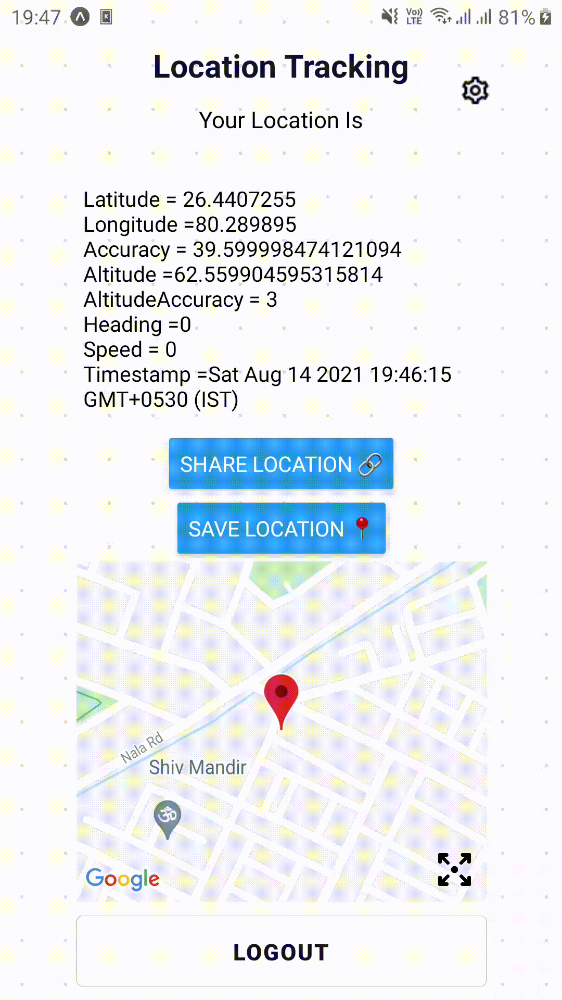

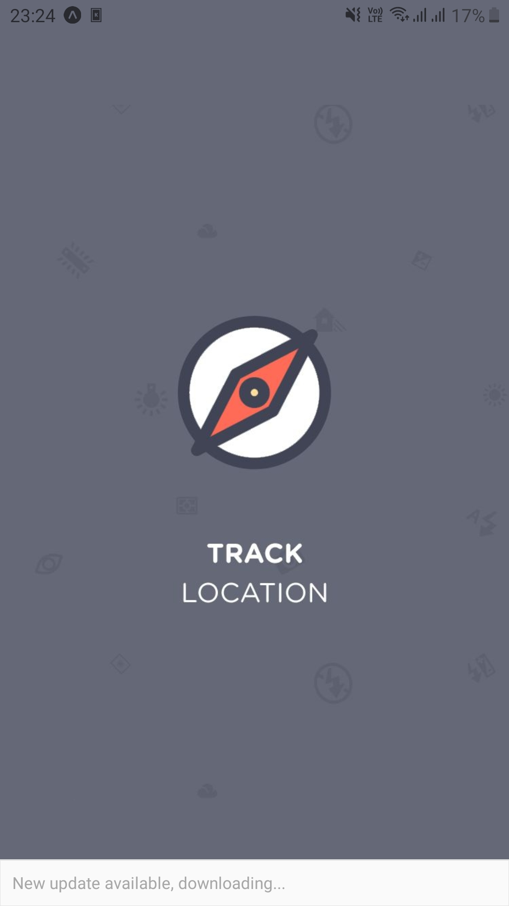

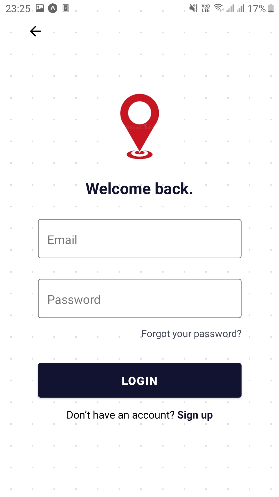

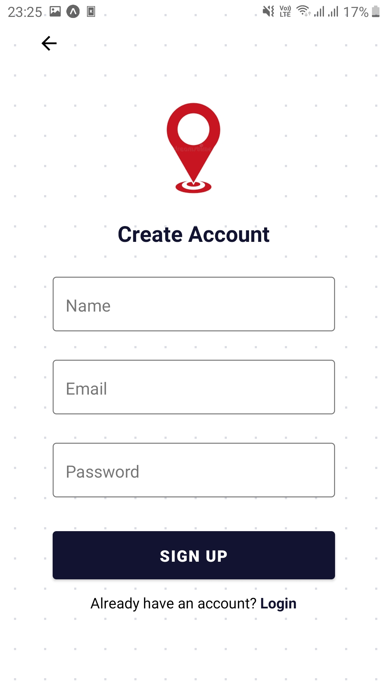

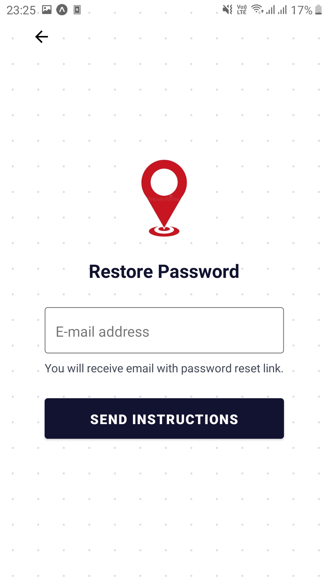

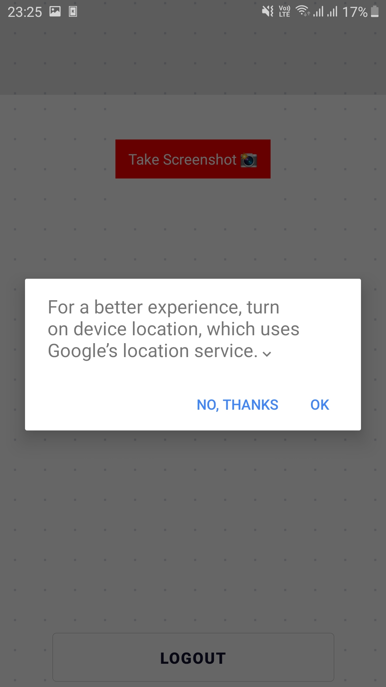

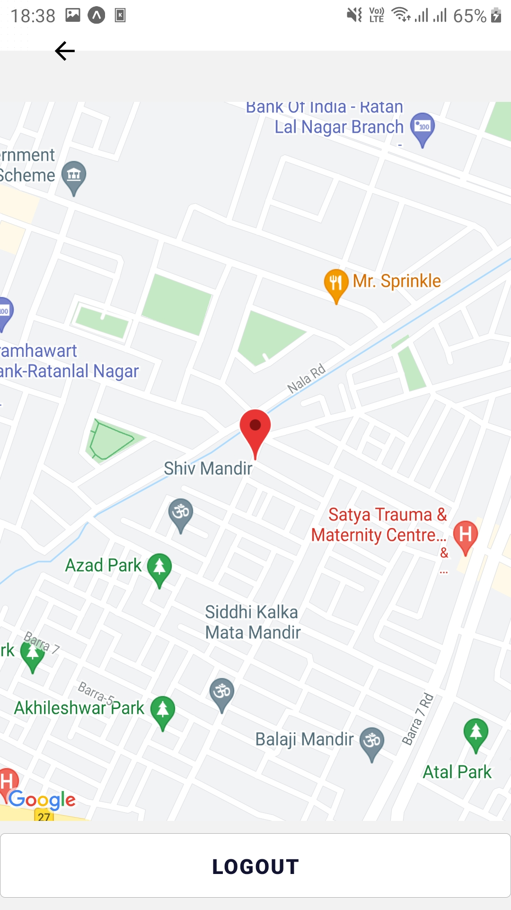

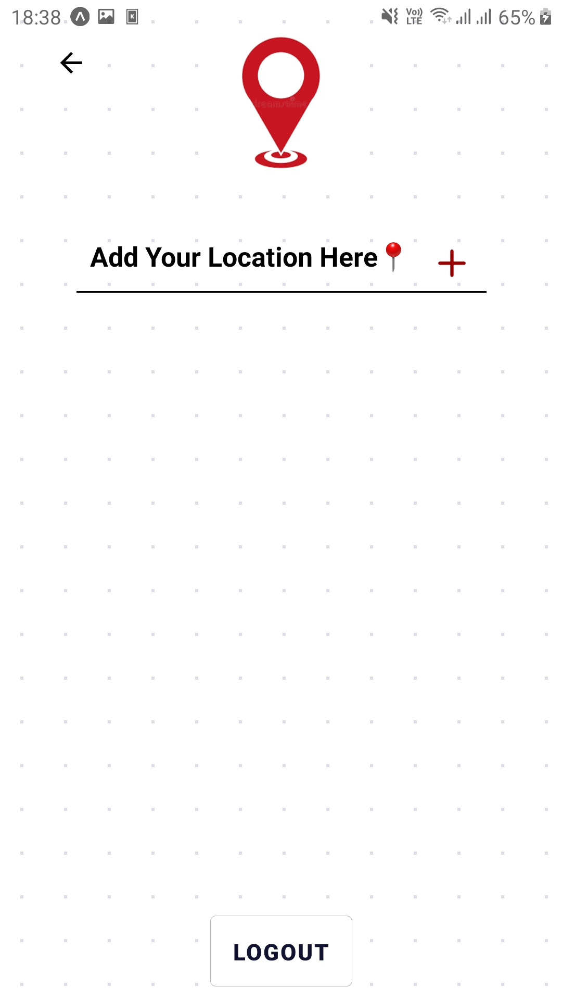

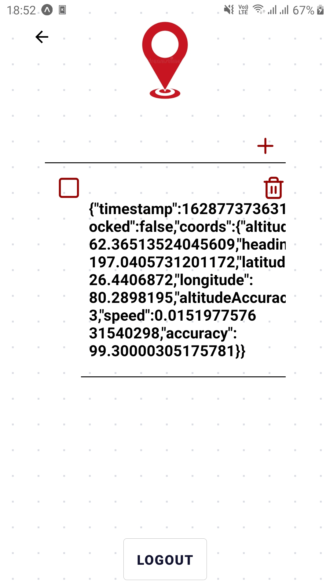

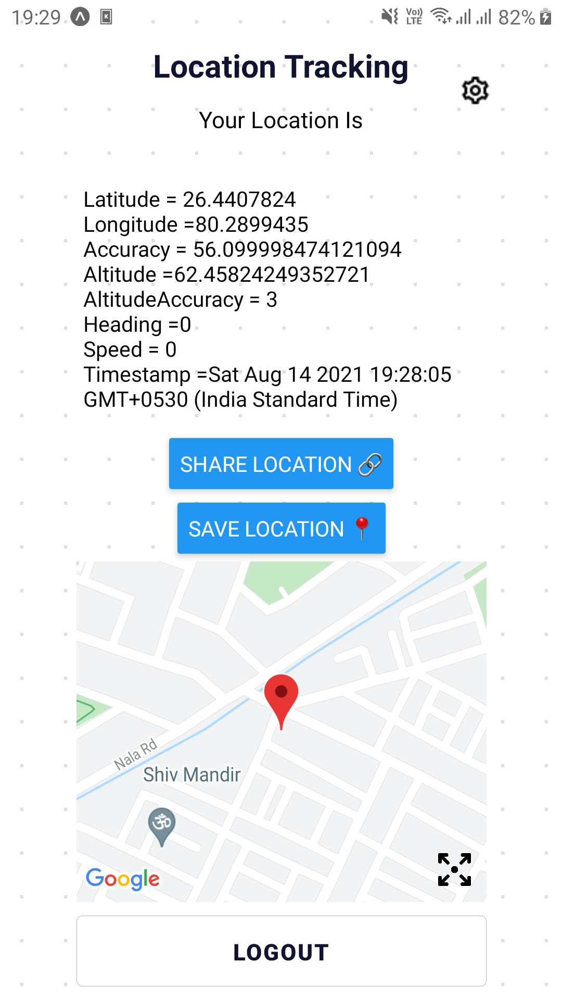

## Installation

`npm install or yarn`

place your firebase api key in src/core/config.js

## Try it On

https://expo.dev/@ujjawal_mandhani/Location_Tracking_App
